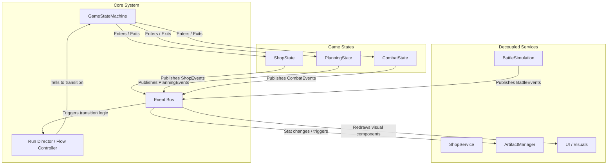

# Roguelike Autobattler: Game Context & Architecture Manual

This document provides a comprehensive overview of the game context, analysis of the current code architecture, key engineering issues, and a roadmap for a decoupled, event-driven design.

---

## 1. Game Concept & Core Vision

The game is a hybrid roguelike autobattler combining mechanics from **Teamfight Tactics (TFT)** and **Balatro**. 

### Core Game Loop (The "Balatro" Flow)
1. **Planning/Preparation Phase**: Arrange unit formations and examine incoming enemy lineups.
2. **PvE Battle Round (TFT-style)**: Automatic combat between the player's team and enemy units.
3. **Shop Round**: Buy units, roll the shop, and purchase synergies, upgrades, or artifacts.
4. **Next Stage Screen**: Transition to the next round.
5. **Boss Round**: Face a specialized, challenging encounter at the end of each stage.
6. **Infinite Mode**: Continue scaling difficulty and testing synergy combinations after victory.

### Mechanics & Build Design
- **Deck as a Unit Bag**: The "deck" you build is the bag/pool of units you can draft from to build your field team.
- **Traits & Synergies**: Units possess specific traits (e.g., Warrior, Goblin) that unlock team-wide bonuses when milestones are met.
- **Joker-like Artifacts**: Collectible items (inspired by Balatro's Jokers) that modify mechanics, multiply combat statistics, influence active traits, or grant economy bonuses.
- **Aesthetic**: Cartoony and polished, inspired by the style of *Dota Underlords*.

---

## 2. Current Architecture Overview

The codebase is organized into several modules within the `Assets/_Game` folder:

1. **[Core](file:///C:/Users/benhu/src/Game/roguelike_autobattler/roguelike_autobattler/Assets/_Game/Core)**: 
   - [IGameState.cs](file:///C:/Users/benhu/src/Game/roguelike_autobattler/roguelike_autobattler/Assets/_Game/Core/IGameState.cs): Defines the state interface (`Enter`, `Exit`, `Tick`).
   - [GameStateMachine.cs](file:///C:/Users/benhu/src/Game/roguelike_autobattler/roguelike_autobattler/Assets/_Game/Core/GameStateMachine.cs): Orchestrates entering, exiting, and ticking game states. Raises state transition events.
   - [GameEvents.cs](file:///C:/Users/benhu/src/Game/roguelike_autobattler/roguelike_autobattler/Assets/_Game/Core/GameEvents.cs): Serves as the central gameplay event bus, enabling decoupled communication of state changes, unit damage, unit defeat, and combat outcomes.
2. **[States](file:///C:/Users/benhu/src/Game/roguelike_autobattler/roguelike_autobattler/Assets/_Game/States)**:
   - [PlanningState.cs](file:///C:/Users/benhu/src/Game/roguelike_autobattler/roguelike_autobattler/Assets/_Game/States/PlanningState.cs): Spawns draft enemies, mocks adding units to player's board, and changes state to combat.
   - [CombatState.cs](file:///C:/Users/benhu/src/Game/roguelike_autobattler/roguelike_autobattler/Assets/_Game/States/CombatState.cs): Sets up [BattleSimulation](file:///C:/Users/benhu/src/Game/roguelike_autobattler/roguelike_autobattler/Assets/_Game/Combat/BattleSimulation.cs) and ticks it until finished, then changes state to shop.
   - [ShopState.cs](file:///C:/Users/benhu/src/Game/roguelike_autobattler/roguelike_autobattler/Assets/_Game/States/ShopState.cs): A placeholder state for shopping interactions.
3. **[Run](file:///C:/Users/benhu/src/Game/roguelike_autobattler/roguelike_autobattler/Assets/_Game/Run)**:
   - [RunManager.cs](file:///C:/Users/benhu/src/Game/roguelike_autobattler/roguelike_autobattler/Assets/_Game/Run/RunManager.cs): A static utility wrapper providing global access to the active [RunModel](file:///C:/Users/benhu/src/Game/roguelike_autobattler/roguelike_autobattler/Assets/_Game/Models/RunModel.cs).
4. **[Models](file:///C:/Users/benhu/src/Game/roguelike_autobattler/roguelike_autobattler/Assets/_Game/Models)**:
   - [RunModel.cs](file:///C:/Users/benhu/src/Game/roguelike_autobattler/roguelike_autobattler/Assets/_Game/Models/RunModel.cs): Holds state variables for the current run (ID, player health, money, unit lists).
   - [UnitModel.cs](file:///C:/Users/benhu/src/Game/roguelike_autobattler/roguelike_autobattler/Assets/_Game/Models/UnitModel.cs): Holds unit stats (health, mana, damage, armor, targets, etc.) for base stats and current-combat stats.
5. **[Combat](file:///C:/Users/benhu/src/Game/roguelike_autobattler/roguelike_autobattler/Assets/_Game/Combat)**:
   - [BattleSimulation.cs](file:///C:/Users/benhu/src/Game/roguelike_autobattler/roguelike_autobattler/Assets/_Game/Combat/BattleSimulation.cs): Controls the turn-less active battle flow, ticking units to attack, find targets, and checking win/loss conditions.
   - [AttackResolver.cs](file:///C:/Users/benhu/src/Game/roguelike_autobattler/roguelike_autobattler/Assets/_Game/Combat/AttackResolver.cs): Evaluates base damage, critical strike hits, armor/magic resist reductions, and deducts health.
   - [UnitTargeting.cs](file:///C:/Users/benhu/src/Game/roguelike_autobattler/roguelike_autobattler/Assets/_Game/Combat/UnitTargeting.cs): Implements target selection.
6. **[Presentation](file:///C:/Users/benhu/src/Game/roguelike_autobattler/roguelike_autobattler/Assets/_Game/Presentation)**:
   - [RunController.cs](file:///C:/Users/benhu/src/Game/roguelike_autobattler/roguelike_autobattler/Assets/_Game/Presentation/RunController.cs): The main `MonoBehaviour` driving the execution loop and game initialization.

---

## 3. Core Architectural Issues
IMPORTANT: if you fix any of these issues, remove them from the issues section, and add it as context to the current architecture section

### A. Tight Coupling of States
States are currently directly responsible for creating and transitioning to their successor states:
* [PlanningState.cs](file:///C:/Users/benhu/src/Game/roguelike_autobattler/roguelike_autobattler/Assets/_Game/States/PlanningState.cs#L52) calls `OnStateChange(new CombatState())`.
* [CombatState.cs](file:///C:/Users/benhu/src/Game/roguelike_autobattler/roguelike_autobattler/Assets/_Game/States/CombatState.cs#L28) calls `_onStateChange(new ShopState())`.

**Why this is an issue:** 
Any change to the progression flow (e.g., adding a "Next Stage Screen" or branching to a "Boss State") requires changing the internal code of existing states. This violates the Open-Closed Principle.


### C. Mixing of Model, Logic, and Setup Responsibilities
* [PlanningState.cs](file:///C:/Users/benhu/src/Game/roguelike_autobattler/roguelike_autobattler/Assets/_Game/States/PlanningState.cs) directly defines the enemy unit stats and adds player units to the team during its `Enter` call.
* [RunManager.cs](file:///C:/Users/benhu/src/Game/roguelike_autobattler/roguelike_autobattler/Assets/_Game/Run/RunManager.cs) provides a static globally mutable endpoint, which makes testing and unit state persistence difficult.

---

## 4. Target Architecture & Design Proposal (Forward Looking)

To support complex synergies, Balatro-style Artifacts, and clean UI/UX separation, the architecture will migrate to an **Event-Driven decoupled model**.



### Key Architectural Enhancements

### 1. Introduce a Central `RunDirector` / Flow Controller
Instead of states instantiating and determining the next phase, states will report their status (e.g., `PlanningCompleted`, `CombatFinished(Outcome)`) to the `RunDirector`. 
* The `RunDirector` keeps track of the current stage, round, and boss conditions, and instructs the [GameStateMachine](file:///C:/Users/benhu/src/Game/roguelike_autobattler/roguelike_autobattler/Assets/_Game/Core/GameStateMachine.cs) which state to switch to.
* This allows adding features like "Next Stage Screens", "Boss Rounds", and "Game Over Screens" without modifying existing gameplay state scripts.

### 2. Implement a Gameplay Event Bus
A static or service-injected event pipeline will publish occurrences across the codebase. Interested systems subscribe to specific event types:
```csharp
public static class GameEvents
{
    // State events
    public static Action<IGameState> OnStateEntered;
    public static Action<IGameState> OnStateExited;

    // Combat events
    public static Action<UnitModel, UnitModel, int> OnUnitDamaged; // Attacker, Target, Damage
    public static Action<UnitModel> OnUnitDefeated;
    public static Action OnCombatStarted;
    public static Action<BattleOutcome> OnCombatEnded;

    // Shop/Economy events
    public static Action<UnitModel> OnUnitPurchased;
    public static Action<ArtifactModel> OnArtifactPurchased;
    public static Action<int> OnGoldChanged;
}
```

### 3. Decouple Game Systems with the Event Bus
* **Visual Effects (VFX/SFX)**: Can listen to `OnUnitDamaged` or `OnUnitDefeated` and instantiate particles/play sounds at the coordinates of the target unit, completely independent of mathematical health resolution.
* **UI Windows**: Listen to `OnGoldChanged` to refresh shop displays, and state transitions to toggle overlay canvas UI panels.

### 4. Build a Flexible Artifact (Joker) Hook System
Artifacts (the Balatro element) will be designed as scriptable modular modifiers that subscribe to the event system upon run startup:
* **Gold-Generator Artifact**: Listens to `OnUnitDefeated`. If the defeated unit was an enemy, it grants the player 1 additional Gold.
* **Critical-Enhancer Artifact**: Listens to `OnUnitDamaged` and checks if the attack was critical; if yes, triggers a shockwave deal-AOE damage event.
* **Trait-Multiplier Artifact**: Modifies the count of active traits in team models.

### 5. Data-Driven Leveling & Enemy Spawning
Rather than hardcoding units in `PlanningState.Enter`:
* Create an `EnemyGenerator` service that maps the current Stage and Round to a database (ScriptableObjects) of enemy squads.
* The state queries this service during setup, keeping state logic lean and focused exclusively on phase execution.
